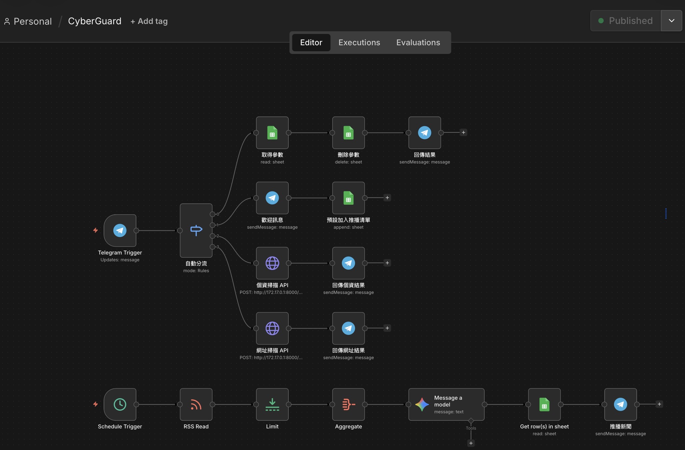

# 🛡️ CyberGuard

## 開發動機

本專案的起點源自於資訊課的 Python 專案要求。在構思主題時，觀察到現今社會正處於資訊大爆炸的時代，**釣魚連結**、**假投資網站**與**大規模個資外洩**等網路犯罪手法日新月異，然而多數**大眾的資安防禦意識卻尚未跟上科技發展的腳步**；一般人在面對可疑訊息時，往往因為缺乏簡單易用的查證管道，或是受限於專業資安工具過高的操作門檻，而將自身暴露於數位風險之中。為了解決這個真實世界的痛點，決定開發這款低門檻的**資安威脅檢測系統**，結合惡意網址判斷與個資外洩檢測
。

此外，單純攔截惡意網址僅是被動的防護，因此進一步運用 n8n 的排程機制，每天主動向使用者推播資安新知，期望透過日常環境的潛移默化，將本專案昇華為能從根本提升大眾防護意識的。

在系統架構的設計上，由於面臨較為緊迫的開發時程，為了確保能將時間與心力全數集中於建構穩定、精準的後端運算核心（FastAPI），採取了[敏捷開發](https://zh.wikipedia.org/zh-tw/%E6%95%8F%E6%8D%B7%E8%BD%AF%E4%BB%B6%E5%BC%80%E5%8F%91)中的[最簡可行產品策略](https://zh.wikipedia.org/zh-tw/%E6%9C%80%E7%B0%A1%E5%8F%AF%E8%A1%8C%E7%94%A2%E5%93%81)：捨棄自建前端網頁，改以 `n8n` 自動化工作流負責後台的資料分流，並直接採用 `Telegram Bot` 作為互動介面。大幅節省了前端開發成本，更讓查證功能無縫融入通訊軟體中，實現隨手可用。

## 核心功能

* **🌐 惡意網址與 IP 判斷 (`/api/scan_url`)**
  * 自動提取網址與解析 IP。
  * 結合<br>
        1. **VirusTotal 聯防引擎**：檢查是否有資安廠商將其列為黑名單。<br>
        2. **AbuseIPDB 評分**：檢查 IP 歷史攻擊與舉報紀錄。<br>
        3. **Whois 網域年資**：偵測「剛建立不到 30 天」的高風險釣魚網站。<br>
    做出風險評分
* **🚨 個資外洩檢測 (`/api/check_leak`)**
  * 整合 BreachDirectory 資料庫。
  * 支援 Email 與台灣手機號碼檢測。
  * 回報該個資曾在多少個外洩資料庫中出現過。<br>
  ⚠️ 因目前使用免費 API ，故查詢效果可能不太理想

## 開發者架設的 Telegram Bot 服務


**👉 [點擊這裡加入 Telegram Bot](https://t.me/csecg_bot)**

##  自行部署指南

本專案適合部署於任何常時運作的 Linux 伺服器 (如 Ubuntu、Debian 等) 環境中，達成全天候監控。

### 前置準備

在開始架設之前，請確保您已取得以下服務的存取權限與金鑰：

#### 資安掃描

* VirusTotal API Key: 網域惡意掃描。
* AbuseIPDB API Key: IP 信用評價查詢。
* RapidAPI Key: 用於 BreachDirectory 或 LeakCheck 個資外洩查詢。

#### 機器人與 AI 整合

* Telegram Bot Token: 透過 @BotFather 申請。
* Google AI (Gemini) API Key: 用於智慧化資安分析與建議。

#### 儲存、雲端與自動化

* Google Sheets: 記錄使用者 Chat ID、掃描歷史與訂閱名單。
* Google Drive: 儲存備份檔案或自動化生成的資安報告。
* Google Cloud Service Account (JSON): 用於授權程式存取 Sheets 與 Drive。
* n8n: 串接所有服務的自動化工作流引擎。

### 後端環境設定

1. 複製專案並裝必要套件

```bash
git clone https://github.com/jyc320/what-are-you-woofing-about.git
cd what-are-you-woofing-about
pip install -r requirements.txt
```

2. 設定環境變數：本專案提供 .env.example 模板，請依照以下指令快速完成配置

```bash
# 複製範例檔案
cp .env.example .env

# 編輯 .env 檔案並填入您的 API 金鑰
nano .env
```

3. 測試啟動服務

```bash
uvicorn main:app --host 0.0.0.0 --port 8000
```
看到 Application startup complete. 就代表成功了！可以用瀏覽器打開 http://你的伺服器IP:8000/docs 看到 FastAPI 自動生成的測試介面。

4. (進階) 註冊為背景服務
* 建立設定檔
```bash
sudo nano /etc/systemd/system/cyberguard.service
```

* 貼上以下內容(請確認 User 與 路徑 符合你的系統設定)
```Ini
[Unit]
Description=FastAPI CyberGuard Brain
After=network.target

[Service]
User=你的使用者名稱
WorkingDirectory=/home/你的使用者名稱/cyberguard
ExecStart=/home/你的使用者名稱/cyberguard/venv/bin/python3 -m uvicorn main:app --host 0.0.0.0 --port 8000
Restart=always

[Install]
WantedBy=multi-user.target
```

* 啟動並設定開機自啟
```bash
sudo systemctl daemon-reload
sudo systemctl start cyberguard
sudo systemctl enable cyberguard
```
5. n8n 工作流串接
    1. 匯入工作流：
        * 在 n8n 面板中點選 "Import from File"。
        * 選擇本專案資料夾中的 [CyberGuard.json](JSON設定檔/CyberGuard.json) 檔案。
    2. 設定端點 (Endpoints)：
        * 找到工作流中的 HTTP Request 節點。將 URL 修改為您 FastAPI 伺服器的位址（例如 http://你的伺服器IP:8000/api/scan_url）。
    3. 啟用 Webhook：
        * 點擊 "Execute Workflow" 進行測試。
        * 確認無誤後，點擊右上角的 "Save" 並將工作流狀態切換為 "Published"

上述步驟完成後即可與 Telegram Bot 互動

### 成果

